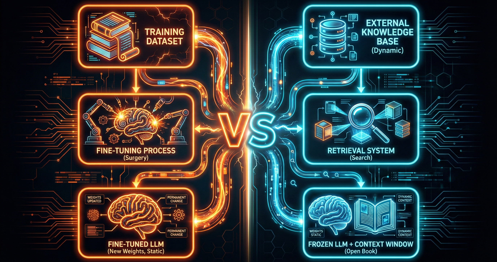
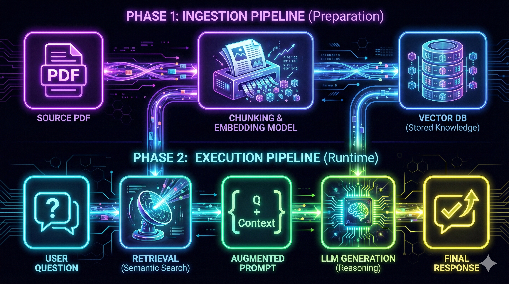

# 00. Fundamentos de RAG (Retrieval-Augmented Generation)

## 1. Introducción: El Cerebro vs. La Biblioteca

Los LLMs como GPT-4, Claude o Gemini tienen dos limitaciones que hacen inviable su uso directo para datos empresariales:

1.  **Conocimiento Congelado (Knowledge Cutoff):** El modelo solo sabe lo que aprendió durante su entrenamiento. Si entrenó hasta 2023, no sabría quién ganó la liga de fútbol en 2024.
2.  **Falta de Contexto Privado:** El modelo no conoce los manuales internos, nóminas, correos electrónicos o bases de datos de tu empresa.

**RAG (Generación Aumentada por Recuperación)** es una arquitectura de ingeniería que soluciona esto. En lugar de confiar en la memoria interna del modelo, le proporcionamos acceso a una "memoria externa" que puede consultar en tiempo real antes de responder.

## 2. Los Problemas que RAG Resuelve

Antes de RAG, intentábamos solucionar estas carencias de dos formas ineficientes:

### A. El Problema de la "Alucinación"

Cuando se le pregunta a un LLM por un dato que no conoce o que recuerda vagamente, el modelo tiende a inventar una respuesta plausible pero falsa para satisfacer al usuario. Esto es inaceptable en contextos legales, médicos o técnicos.

- **Solución RAG:** RAG obliga al modelo a responder **basándose únicamente** en los fragmentos de texto que le hemos entregado ("Grounding"), reduciendo drásticamente la invención.

### B. El Problema de la Ventana de Contexto (Context Window)

Aunque los modelos actuales aceptan miles de tokens (palabras), no podemos simplemente pegar un PDF de 500 páginas en el prompt.

1.  **Coste:** Pagaríamos por procesar 500 páginas en cada pregunta.
2.  **Efecto "Lost in the Middle":** Se ha demostrado que cuando le das demasiada información a un modelo, tiende a olvidar lo que está en el medio del texto y solo recuerda el principio y el final.
3.  **Latencia:** Esperaríamos minutos por una respuesta.

- **Solución RAG:** Un RAG selecciona solo los 3 o 5 párrafos relevantes para la pregunta, ignorando el resto del documento.

## 3. ¿Qué es RAG? La Metáfora del Examen

Para entender la diferencia entre un LLM estándar, un LLM con Fine-Tuning y un sistema RAG, usamos la siguiente analogía académica:

| Enfoque         | Analogía                                                              | Descripción Técnica                                                                                                      |
| :-------------- | :-------------------------------------------------------------------- | :----------------------------------------------------------------------------------------------------------------------- |
| **LLM Base**    | Un estudiante inteligente sin preparación específica.                 | Usa solo sus pesos pre-entrenados.                                                                                       |
| **Fine-Tuning** | Un estudiante que cursa la carrera de Medicina durante 4 años.        | Modifica los pesos del modelo neuronal para aprender nuevos patrones, jerga o estilos. Es lento y costoso de actualizar. |
| **RAG**         | **Un estudiante inteligente con el libro abierto durante el examen.** | Mantiene el modelo congelado pero inyecta la respuesta en el prompt. Es dinámico, barato y auditable.                    |

> **Cuándo usar RAG:** Cuando necesitas precisión factual, citar fuentes, datos privados o información que cambia frecuentemente (ej. stock de almacén).

## 4. Arquitectura de Alto Nivel: El Flujo RAG

Un sistema RAG no es una sola llamada a una API, sino un flujo de datos (Pipeline) que consta de dos fases:

### Fase 1: Indexación (Preparación de Datos)

Ocurre _antes_ de que el usuario pregunte nada.

1.  **Carga (Load):** Extraemos texto de PDFs, Webs, Word, etc.
2.  **Fragmentación (Chunk):** Dividimos el texto en trozos pequeños y manejables.
3.  **Incrustación (Embed):** Convertimos esos trozos en vectores numéricos (listas de números) que representan su significado.
4.  **Almacenamiento (Store):** Guardamos esos vectores en una Base de Datos Vectorial.

### Fase 2: Recuperación y Generación (Tiempo de Ejecución)

Ocurre cuando el usuario hace una pregunta.

1.  **Consulta:** El usuario pregunta "¿Cómo arreglo el error E-25?".
2.  **Búsqueda (Retrieve):** El sistema busca en la base de datos los vectores más parecidos matemáticamente a la pregunta.
3.  **Aumentación (Augment):** El sistema crea un prompt que dice: _"Usa el siguiente contexto recuperado: [Texto del Manual], para responder a la pregunta: [Error E-25]"_.
4.  **Generación (Generate):** El LLM genera la respuesta final en lenguaje natural.

## 5. Ventajas para la Empresa

Implementar un "Inspector de PDF" o un "Chat con tus datos" mediante RAG ofrece ventajas competitivas claras frente a otras soluciones de IA:

1.  **Auditabilidad y Citas:** El sistema puede decirte: _"Sé esto porque lo leí en la página 43 del manual X"_. Un LLM normal no puede hacer esto.
2.  **Privacidad de Datos:** Tus datos privados no se usan para entrenar al modelo público de OpenAI o Google. Se mantienen en tu base de datos vectorial controlada.
3.  **Actualización Inmediata:** Si cambia una ley o un precio, solo tienes que reemplazar el PDF en tu base de datos. No necesitas re-entrenar (Fine-tune) nada, lo cual ahorraría miles de dólares y semanas de cómputo.
4.  **Economía:** Es mucho más barato enviar 1.000 tokens relevantes al modelo que enviar un libro entero de 100.000 tokens en cada consulta.

 

> 💡 **Key Takeaway (Nota del Profesor):**
> No pienses en RAG como "entrenar una IA". Piénsalo como **construir un buscador inteligente** que le pasa los apuntes correctos al modelo para que redacte la respuesta final. La calidad de tu sistema depende de la calidad de tus datos, no de la inteligencia del modelo.

## ⏭️ Próximos Pasos

Ahora que entendemos el _por qué_ y la arquitectura general, debemos empezar por el principio del flujo de datos: **Cómo preparar nuestros documentos para que la IA los entienda.**

En el siguiente módulo profundizaremos en la **Ingeniería de Ingesta**:

- 👉 **[01. Ingesta y Fragmentación (Chunking)](./01-ingestion.md)**: Aprenderemos por qué no podemos simplemente copiar y pegar el texto, y cómo dividirlo sin romper su significado.
