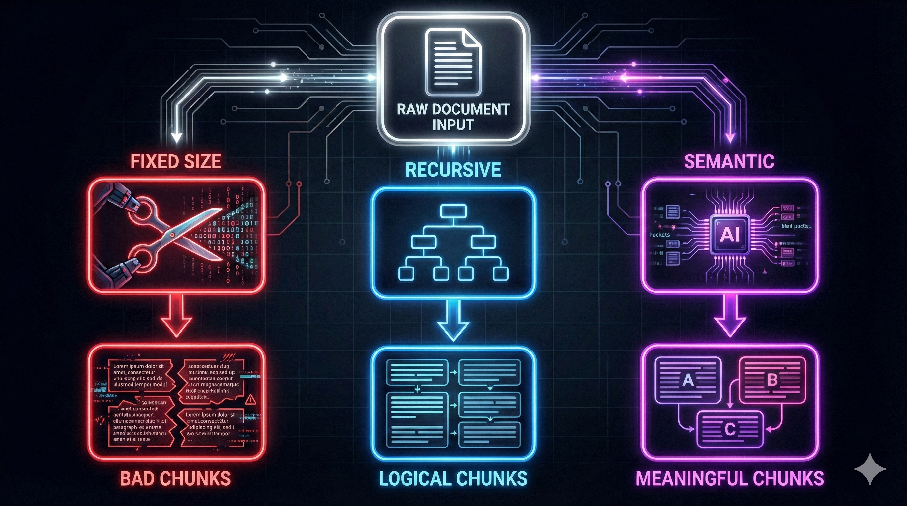
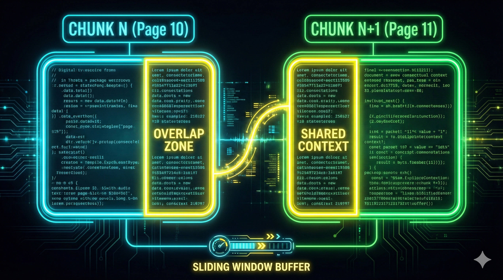

# 01. Ingesta y Fragmentación (Data Ingestion & Chunking)

## 1. Introducción: "Garbage In, Garbage Out"

El principio fundamental de la ingeniería de datos aplica doblemente en RAG. Un LLM no puede "arreglar" un contexto que le llega roto, desordenado o sin sentido. La fase de Ingesta es el proceso ETL (Extract, Transform, Load) adaptado a la IA Generativa.

## 2. Parsing y Fuentes de Datos (Extraction)

El primer reto es convertir "archivos binarios" en "texto plano limpio". Cada formato tiene sus demonios:

### A. Documentos No Estructurados (PDFs, Word)

- **PDF (Portable Document Format):** Es el enemigo nº1 del ingeniero de RAG. No contiene "texto", contiene instrucciones de dibujo ("pon la letra 'A' en la coordenada X,Y").
  - _Reto:_ Columnas múltiples, tablas que se rompen, encabezados y pies de página que se repiten en cada hoja (y ensucian la búsqueda).
  - _Herramientas:_ `PyPDF` (básico), `Unstructured.io` (avanzado), `LlamaParse` (IA visual para entender tablas).
- **Word (DOCX):** Más amigable. Conserva la jerarquía (H1, H2, H3), lo cual es oro para el chunking estructural.

### B. Datos Estructurados (SQL, CSV, Excel)

- _Error común:_ Convertir una fila de Excel en texto plano sin contexto.
  - _Mal:_ "25, Juan, 2023"
  - _Bien:_ "El empleado Juan tiene 25 años y se registró en 2023."
- _Estrategia:_ "Text-to-Text serialization". Convertir cada fila en un párrafo narrativo antes de vectorizar.

## 3. Limpieza y Normalización (Cleaning)

Antes de cortar, debemos limpiar. Si indexamos "ruido", recuperaremos "ruido".

1.  **Eliminación de Artefactos:** Quitar "Página 1 de 20", "Confidencial", y marcas de agua que se repiten y confundirían a la búsqueda semántica.
2.  **Normalización de Espacios:** Convertir saltos de línea múltiples (`\n\n\n`) en uno solo y espacios dobles en simples.
3.  **Redacción de PII (Personally Identifiable Information):** Crítico en banca/salud. Detectar y ofuscar emails/DNI antes de enviar a OpenAI/VectorDB.
4.  **Manejo de Encoding:** Arreglar los terribles `mojibakes` (caracteres corruptos como `ñ` en vez de `ñ`).

## 4. Enriquecimiento (Enrichment & Metadata)

**El gran secreto de los sistemas profesionales.** No guardes solo el texto. Guarda el contexto del archivo.
Los metadatos permiten el **Pre-Filtering** (filtrar antes de buscar vectores).

- **Metadata Design:**
  - `source`: "manual_empleado.pdf"
  - `page`: 15
  - `author`: "RRHH"
  - `date`: "2023-10-01"
  - `category`: "Legal"

<br>

> **Caso de Uso:** El usuario pregunta _"¿Cuáles son las políticas de vacaciones de 2024?"_.
>
> - Sin metadatos: La búsqueda vectorial podría traer las políticas de 2020 si el texto es muy similar.
> - Con metadatos: Filtramos `year == 2024` y luego buscamos vectores. Precisión 100%.

## 5. Estrategias de Fragmentación (Chunking Strategies)

La fragmentación o _Chunking_ no es un simple paso de preprocesamiento; es una decisión de arquitectura que define el rendimiento de todo el sistema RAG. Nos enfrentamos a un compromiso fundamental (**Trade-off**) entre **Contexto** y **Ruido**:

1.  **Chunks muy pequeños (Micro-chunking):** Capturan datos específicos ("El precio es 5€"), pero pierden el contexto de _qué_ es ese precio. El vector resultante es ambiguo.
2.  **Chunks muy grandes (Macro-chunking):** Capturan todo el contexto, pero diluyen la señal semántica. Si el usuario busca un dato específico, el vector del chunk grande (que es un promedio de todos sus temas) no se alineará bien con la pregunta.

El objetivo de la ingeniería de fragmentación es encontrar la **Unidad Atómica de Información**: el fragmento de texto mínimo que mantiene su significado completo y autónomo.
<br>



---

### A. Fixed-Size Chunking (Fragmentación de Tamaño Fijo)

Es la aproximación más primitiva y computacionalmente económica. Consiste en definir un número estricto de caracteres o tokens (ej. 500) y realizar cortes "duros" secuencialmente.

- **Mecánica:** Se trata al texto como una cadena de bytes continua. Al llegar al carácter 500, se corta, independientemente de si estamos a mitad de una palabra, una frase o un párrafo.
- **Análisis Crítico:** Aunque es fácil de implementar, es **semánticamente destructiva**.
  - _Ejemplo de fallo:_ "La clave de la API no debe ser compartida jamás con... [CORTE] ...nadie externo a la empresa."
  - _Consecuencia:_ El Chunk 1 dice qué no hacer, pero no con quién. El Chunk 2 dice con quién, pero no qué. Ambos vectores son inútiles para la recuperación.
- **Uso Académico:** Se reserva exclusivamente para pruebas de concepto (PoC) iniciales o para textos donde la estructura lingüística es irrelevante (ej. secuencias de ADN).

### B. Recursive Character Chunking (Fragmentación Recursiva)

Este es el **Estándar de la Industria** actual. Es una evolución heurística del tamaño fijo que intenta respetar la sintaxis del lenguaje humano.

- **Mecánica:** El algoritmo no corta ciegamente. Posee una lista jerárquica de separadores, típicamente: `["\n\n", "\n", ".", " ", ""]`.
  1.  Intenta dividir el texto usando el separador de mayor nivel (Párrafos `\n\n`).
  2.  Si el fragmento resultante es menor al límite (ej. 1000 tokens), lo acepta.
  3.  Si el fragmento es mayor, recurre al siguiente separador (Líneas `\n`) para subdividirlo.
  4.  Si aún es muy grande, baja al nivel de frases (`.`) y finalmente palabras.
- **Justificación:** Al priorizar los párrafos, mantenemos unidas las ideas que el autor original agrupó, preservando la coherencia local. Solo rompemos frases cuando es estrictamente necesario por limitaciones de tamaño.

### C. Structure-Based / Markdown Chunking (Fragmentación Estructural)

Esta estrategia no trata al documento como texto plano, sino como un árbol jerárquico de información. Es vital para documentación técnica, legal o financiera.

- **Mecánica:** Primero se realiza un paso de **Parsing Avanzado** (ej. usando `Unstructured` o `LlamaParse`) para convertir el PDF/Word a formato Markdown o HTML. Luego, se agrupa el texto basándose en sus encabezados (`Headings`).
- **El Concepto de "Contexto Heredado":**
  - Imagina un manual con dos secciones: `Hardware > Requisitos` y `Software > Requisitos`.
  - Si cortamos solo el texto "Requisitos", ambos chunks serían idénticos e indistinguibles.
  - En esta estrategia, el chunk "hijo" hereda los metadatos del "padre".
  - _Chunk Final:_ "Hardware > Requisitos: 8GB RAM..."
- **Ventaja:** Elimina la ambigüedad semántica en documentos repetitivos.

### D. Semantic Chunking (Fragmentación Semántica)

Considerado el **Estado del Arte (SOTA)**, esta técnica abandona las reglas sintácticas (puntos y comas) para basarse en el significado real del texto.

- **Mecánica (Algoritmo de Segmentación):**
  1.  **Oracionado:** Se divide el texto en oraciones individuales.
  2.  **Vectorización Secuencial:** Se genera un embedding para cada oración (usando un modelo ligero).
  3.  **Cálculo de Distancia:** Se mide la similitud del coseno entre la oración $N$ y la oración $N+1$ (o una ventana de oraciones).
  4.  **Detección de Fronteras:** Se analizan los valores de similitud.
      - Si la similitud es alta (ej. 0.8), ambas oraciones hablan de lo mismo $\rightarrow$ Se agrupan.
      - Si la similitud cae drásticamente (un "valle" en la gráfica, ej. baja a 0.3), indica un **Cambio de Tema** $\rightarrow$ Se inserta un punto de corte.
- **Justificación:** Garantiza que cada chunk sea "temáticamente puro". Evita mezclar, por ejemplo, una introducción legal con una tabla de precios técnica en el mismo vector.
- **Coste:** Requiere inferencia de modelo durante la ingesta, lo que aumenta el tiempo y coste de procesamiento (GPU).

---

## 6. Sliding Window & Overlap (Ventana Deslizante y Solapamiento)

Incluso con las mejores estrategias de corte, existe el riesgo estadístico de cortar una entidad clave o una relación lógica justo por la mitad. Para mitigar esto, introducimos redundancia controlada.

### 6.1. El Concepto de Overlap

Si definimos un `chunk_size` de 1000 tokens, configuramos un `chunk_overlap` de 100-200 tokens (10-20%). Esto significa que los últimos 200 tokens del Chunk A se repiten como los primeros 200 tokens del Chunk B.

El objetivo de esta técnica es garantizar la continuidad del contexto. Si una pregunta depende de una frase que estaba en el límite, el solapamiento asegura que esa frase exista _completa_ en al menos uno de los dos chunks.



### 6.2. El Reto de la Paginación en Sistemas Distribuidos (Large PDF Processing)

Cuando procesamos documentos masivos (ej. 500+ páginas) en un entorno de producción, no podemos cargar todo el texto en memoria RAM (`text = pdf.read()`). Debemos procesar por flujos (streaming) o en paralelo (workers).

**El Problema del Límite de Página:**
Si enviamos la Página 10 al Servidor A y la Página 11 al Servidor B, perdemos la conexión semántica. Una frase puede empezar al final de la pág. 10 y terminar al inicio de la pág. 11.

- _Resultado:_ El Servidor A tiene el sujeto ("El contrato...") y el Servidor B tiene el predicado ("...se anula en 2025"). Ninguno tiene la información completa.

**Solución de Ingeniería: Buffering Inter-Páginas**
Para implementar esto correctamente en un sistema distribuido (como Celery o AWS Lambda), no procesamos páginas aisladas. Usamos una estrategia de **Stateful Buffer**:

1.  **Lectura con Pre-fetch:** Al procesar la Página $N$, el sistema debe tener acceso a los últimos $K$ tokens de la Página $N-1$.
2.  **Algoritmo de Unión:**

    ```python
    # Pseudocódigo de lógica distribuida
    texto_pagina_anterior = cache.get(page_id - 1)[-overlap_size:]
    texto_pagina_actual = pdf.extract_text(page_id)

    # Unimos el final de la anterior con el inicio de la actual ANTES de hacer chunking
    texto_completo_para_procesar = texto_pagina_anterior + texto_pagina_actual

    chunks = recursive_splitter(texto_completo_para_procesar)
    ```

3.  **Persistencia del Estado:** Si usamos procesamiento paralelo puro (donde la pág 10 y 11 se procesan a la vez sin saber una de la otra), debemos solapar a nivel de extracción:
    - _Worker 1:_ Procesa Páginas 1-10.
    - _Worker 2:_ Procesa Páginas 10-20 (La página 10 se procesa dos veces deliberadamente para asegurar la continuidad en la frontera).

Esta redundancia es insignificante en almacenamiento pero crítica para evitar "puntos ciegos" en la recuperación de información.
<br>

> 💡 **Key Takeaway (Nota del Ingeniero):**
> El 60% de los problemas de calidad en RAG ("mi bot no encuentra el dato") no son culpa del modelo de IA, son culpa de una mala estrategia de Chunking. Si el dato se corta mal, el vector se genera mal, y la búsqueda falla. **Invierte tiempo aquí.**

## ⏭️ Próximos Pasos

Una vez tenemos el texto limpio y fragmentado, el siguiente paso es convertir esas palabras en números para que la máquina las entienda.
Entramos en el mundo de la matemática vectorial:

- 👉 **[02. El Espacio Vectorial (Embeddings)](./02-embeddings.md)**: Modelos, dimensiones y similitud del coseno.
