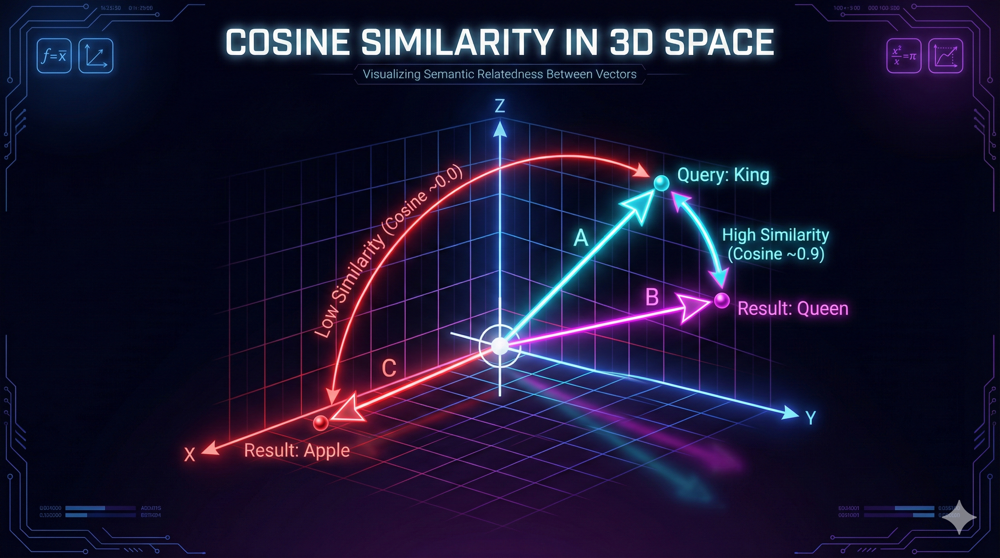
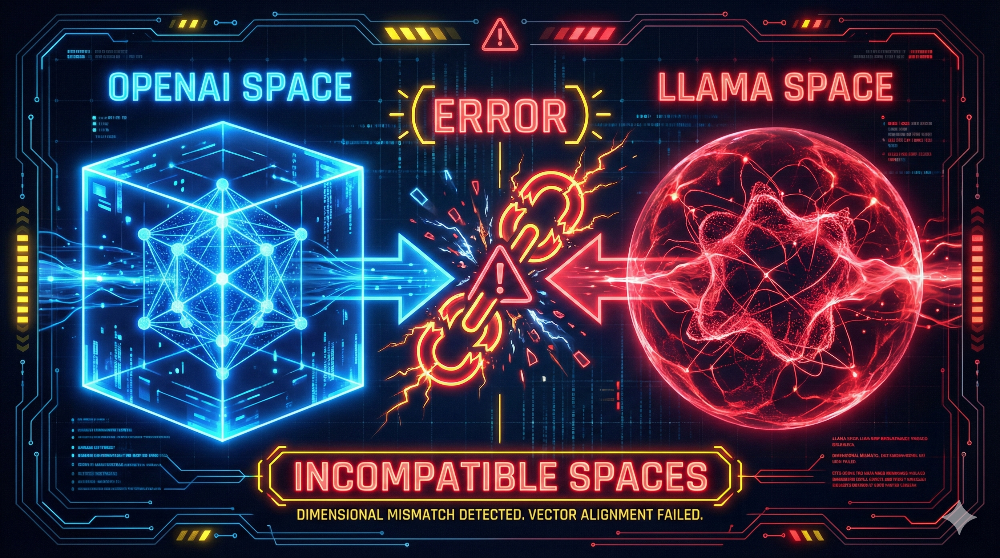

# 02. El Espacio Vectorial y los Embeddings

## 1. Introducción: La Frontera entre Lenguaje y Matemática

Si la **Ingesta** y la **Fragmentación** (Chunking) son los procesos de preparación de la materia prima, la **Vectorización** es el proceso de transformación alquímica.

En esta fase, convertimos el texto (subjetivo, ambiguo y variable) en representaciones numéricas fijas (vectores). Este paso es la conclusión lógica del pipeline de ingesta: el dato no está realmente "ingestado" hasta que no reside como una entidad matemática dentro de una Base de Datos Vectorial.

## 2. Fundamentos Matemáticos

### 2.1. De Token a Vector

Los Modelos de Lenguaje (LLMs) no leen palabras; procesan **Tokens**.

1.  **Tokenización:** El texto se rompe en unidades sub-palabra. (Ej: "Ingeniería" $\rightarrow$ `["Ing", "en", "ier", "ía"]`).
2.  **Vectorización:** Una red neuronal (el modelo de embedding) procesa la secuencia de tokens y emite una lista de números de punto flotante (floats).

> **El Vector:** Es una lista de coordenadas en un espacio multidimensional.
> $$V = [0.12, -0.55, 0.91, \dots, 0.04]$$
> Cada número representa la magnitud de una característica semántica abstracta (ej. "nivel de formalidad", "relación con la tecnología", "sentimiento positivo"), aunque estas características son latentes y no interpretables directamente por humanos.

### 2.2. Similitud del Coseno (La Métrica de Distancia)

En el espacio vectorial, no nos importa tanto cuán "lejos" están dos puntos (Distancia Euclidiana), sino si apuntan a la misma "dirección" (significado).

Usamos la **Similitud del Coseno** para medir el ángulo entre dos vectores:

$$\text{Cosine}(A, B) = \frac{A \cdot B}{\|A\| \|B\|} = \frac{\sum A_i B_i}{\sqrt{\sum A_i^2} \sqrt{\sum B_i^2}}$$

- **1.0 (0º):** Los vectores son idénticos en significado.
- **0.0 (90º):** Los vectores son ortogonales (no tienen ninguna relación semántica).
- **-1.0 (180º):** Los vectores son opuestos semánticamente (poco común en embeddings de texto modernos).

## 3. Modelos de Embeddings: El Motor Semántico

La elección del modelo determina la "inteligencia" de tu sistema de recuperación. Un modelo es una red neuronal entrenada específicamente para comprimir texto en vectores densos.

### 3.1. Dimensiones y Compresión

La dimensión es el tamaño del vector resultante.

- **Modelos Pequeños (384 - 768 dimensiones):** Ej. `all-MiniLM-L6-v2`. Rápidos, ocupan poco espacio. Ideales para Semantic Chunking o dispositivos móviles.
- **Modelos Grandes (1536 - 3072 dimensiones):** Ej. `text-embedding-3-large`. Capturan matices sutiles y relaciones complejas. Estándar para RAG empresarial.
- **Matryoshka Embeddings (Truncamiento):** Modelos modernos (como los de OpenAI o Nomic) permiten "recortar" el vector (ej. usar solo las primeras 512 dimensiones de un vector de 3072) manteniendo la mayoría de la información semántica.

### 3.2. Ventana de Contexto (Max Sequence Length)

Cada modelo tiene un límite de cuánto texto puede "leer" para generar un solo vector.

- **Modelos BERT antiguos:** 512 tokens. (Si tu chunk es de 1000, el modelo corta y pierde la mitad).
- **Modelos Modernos:** 8192 tokens. (Permiten vectorizar documentos o chunks muy extensos sin pérdida).

### 3.3. Multilingüismo

- **Monolingües:** Entrenados solo en inglés. Si buscas "Abogado" en un texto en inglés vectorizado con un modelo monolingüe, la similitud será baja.
- **Multilingües:** Alinean el espacio vectorial de múltiples idiomas. El vector de "Cat" y el vector de "Gato" caen casi en la misma coordenada.

## 4. Ingeniería de Sistemas Vectoriales

### 4.1. La Regla de Incompatibilidad (Critical Warning)

> ⚠️ **ADVERTENCIA DE ARQUITECTURA:**
> Los espacios vectoriales son **únicos por modelo**.
>
> - El vector de "Hola" generado por OpenAI es matemáticamente incompatible con el vector de "Hola" generado por Cohere o Llama.
> - **Consecuencia:** Si cambias de modelo de embeddings a mitad de proyecto, **debes re-indexar (volver a generar vectores) para toda tu base de datos.** No puedes mezclar vectores de modelos distintos.

### 4.2. Estrategia Híbrida de Modelos

Podemos optimizar costes y latencia usando modelos diferentes para tareas diferentes, _siempre que no se comparen entre sí_:

1.  **Ingesta (Semantic Chunking):** Usar un modelo local ultra-rápido (`all-MiniLM`) solo para decidir dónde cortar el texto.
2.  **Almacenamiento (Indexing):** Usar un modelo potente (`text-embedding-3`) para generar el vector final que se guarda en la DB.

## 5. Bases de Datos Vectoriales (Persistencia)

Una vez tenemos los vectores, ¿dónde los guardamos? Las bases de datos tradicionales (SQL) no están optimizadas para calcular la distancia del coseno entre millones de filas en milisegundos.

### 5.1. Servicios en la Nube (Cloud Managed)

Ideales para escalar sin gestionar infraestructura.

- **AWS (Amazon Web Services):**
  - **OpenSearch Service:** Motor potente con soporte vectorial.
  - **Aurora PostgreSQL (pgvector):** Si ya usas RDS, puedes activar la extensión vectorial.
- **Azure (Microsoft):**
  - **Azure AI Search:** Anteriormente Cognitive Search. Muy integrado con el ecosistema OpenAI.
- **GCP (Google Cloud):**
  - **Vertex AI Vector Search:** Optimizado para latencia ultra-baja y escala masiva.
- **Nativos de Vectores:**
  - **Pinecone:** Líder del mercado SaaS. Serverless y muy fácil de usar.

### 5.2. Open Source & Self-Hosted (Docker)

Ideales para privacidad total, costes fijos o desarrollo local.

- **Qdrant:** Escrito en Rust. Rendimiento excepcional y muy popular en la comunidad moderna de IA.
- **Weaviate:** Escrito en Go. Enfoque modular y plug-and-play.
- **ChromaDB:** Muy simple, enfocado a Python y notebooks.
- **Milvus:** Diseñado para escalas masivas (billones de vectores).

## 6. Costes y Escalabilidad

El diseño de un sistema RAG debe considerar el coste operativo desde el día 1.

### 6.1. Coste de Inferencia (API)

Los proveedores cobran por **millón de tokens**.

- _Ejemplo:_ Indexar 1 millón de páginas de documentos corporativos con un modelo caro puede costar cientos de dólares.
- _Optimización:_ Usar modelos Open Source (HuggingFace) en infraestructura propia reduce este coste a cero (solo pagas electricidad/GPU).

### 6.2. Coste de Almacenamiento (Memoria/Disco)

Los vectores son pesados.

- Un vector `float32` de **1536 dimensiones** ocupa: $1536 \times 4 \text{ bytes} \approx 6 \text{ KB}$.
- **1 Millón de vectores** $\approx 6 \text{ GB}$ de RAM/Disco.

> **Nota de Escalabilidad:** Muchas bases de datos vectoriales (como Qdrant o Pinecone) intentan cargar los índices en memoria RAM para máxima velocidad. Si tu base de datos crece a 100GB, necesitarás servidores con mucha RAM, lo cual es costoso.

---

> 💡 **Key Takeaway (Nota del Profesor):**
> No elijas el modelo de embeddings más grande "por si acaso". Un modelo de 3072 dimensiones cuesta el doble de almacenar y es el doble de lento de buscar que uno de 1536. En ingeniería, **suficiente es mejor que excesivo**. Para la mayoría de los casos, un modelo estándar de ~768 o ~1536 dimensiones es el punto dulce.

## ⏭️ Próximos Pasos

Ya tenemos nuestros datos convertidos en vectores y sabemos dónde guardarlos. Pero tener los datos guardados no sirve de nada si no podemos encontrarlos rápidamente.

En el siguiente módulo, exploraremos los **algoritmos de búsqueda** que permiten encontrar una aguja en un pajar de millones de vectores en milisegundos:

- 👉 **[03. Búsqueda Vectorial y Algoritmos (HNSW)](./03-vector-dbs.md)**: Cómo funcionan los índices vectoriales y la búsqueda híbrida.
